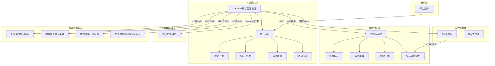
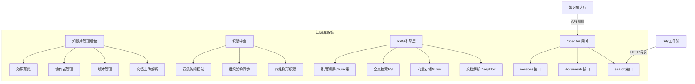
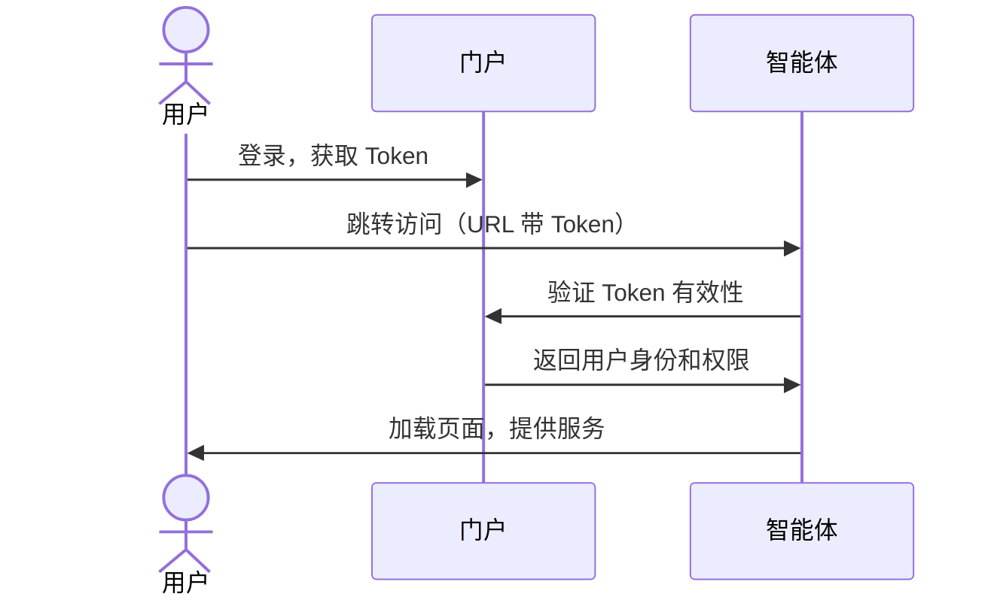
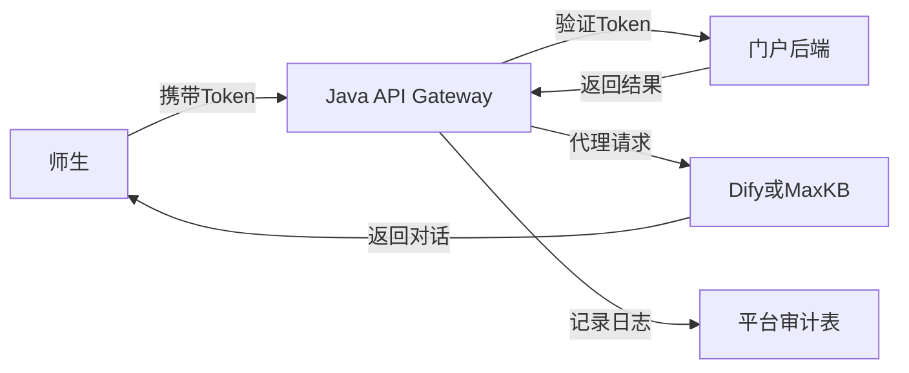
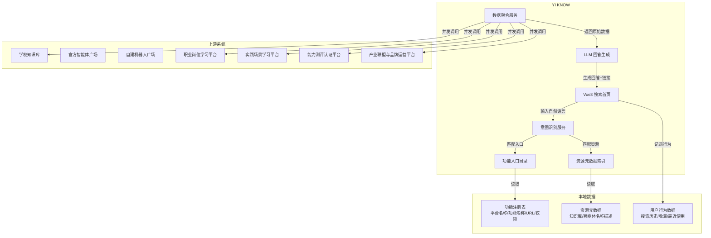
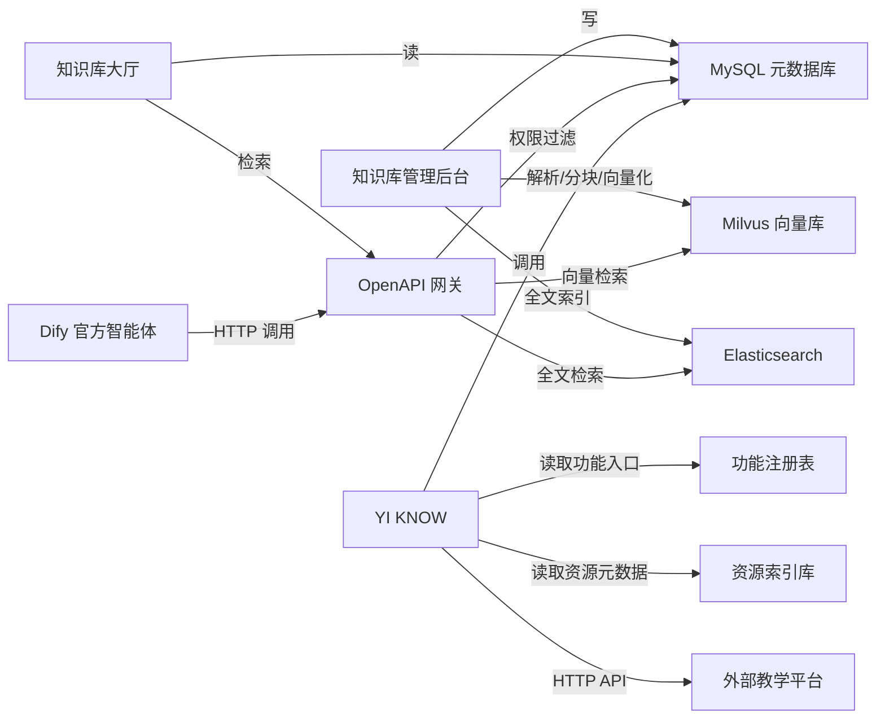
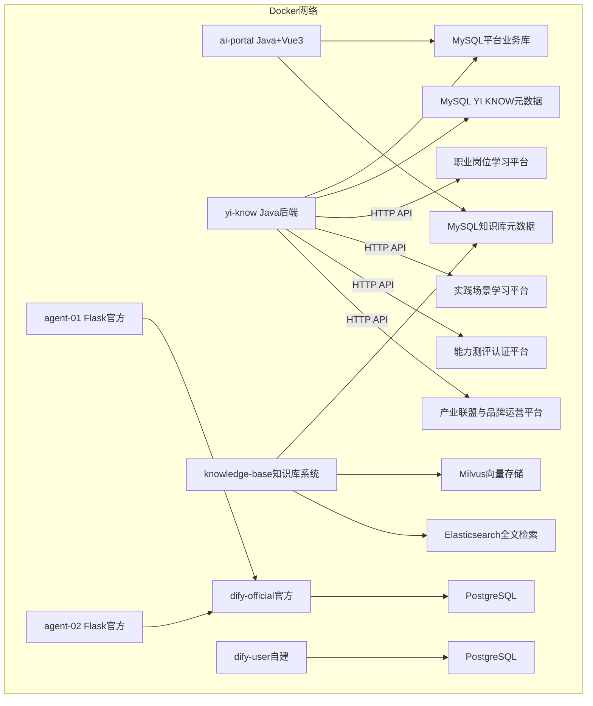

# 学校 AI 服务平台建设方案（技术版）

## 一、整体架构

学校 AI 服务平台由四大独立系统组成，通过统一身份认证和 Token 鉴权实现松耦合集成：

| 系统 | 定位 | 技术底座 | 负责团队 |
|------|------|----------|----------|
| **学校知识库** | 独立产品模块，沉淀数智资产 | 自研（Java + RAGFlow/FastGPT） | Java 团队 |
| **官方智能体** | 复杂业务场景专用机器人 | dify-project-template（Dify + Flask） | AI 团队 |
| **自建机器人** | 师生零代码创建对话助手 | 独立部署 Dify/MaxKB | AI 团队 |
| **YI KNOW 教学智能助理** | 统一发现与导航层 | 自研（Java + Vue3 + LLM） | Java 团队 |
| **AI 服务门户** | 统一入口、鉴权、审计 | 自研（Java + Vue3） | Java 团队 |



---

## 二、学校知识库（自研独立模块）

### 2.1 设计原则

- **权限内聚**：所有权限判断在自研知识库内部完成，Dify 不感知、不存储权限逻辑
- **接口标准化**：暴露统一搜索 API，Dify 通过 HTTP 请求节点调用
- **引擎可替换**：RAG 引擎层与业务层解耦，未来可平滑替换

### 2.2 技术架构



### 2.3 核心模块说明

**权限中台**
- 四级树形结构：校级（10）→ 院级（01）→ 专业级（01）→ 岗位级（01），编码如 `10-01-01-01`
- 上级继承下级可见：院级用户可见本院及下属所有专业/岗位知识库
- 组织架构同步：对接学校 LDAP/教务系统，自动映射用户权限层级
- 行级访问控制：知识库文档级别权限，支持协作者邀请

**RAG 引擎层**
- 文档解析：使用 DeepDoc 处理 PDF/Word/PPT/Excel/图片，提取结构化文本和表格
- 分块策略：按段落/语义/表格自动分块，支持自定义分块大小和重叠
- 向量存储：Milvus 存储文档向量，支持相似度检索
- 全文检索：Elasticsearch 存储文档原文，支持关键词检索
- 混合检索：向量相似度 + 关键词 BM25 加权融合，提升召回率
- 引用溯源：每个 Chunk 记录来源文档、页码、段落位置，问答时返回溯源信息

**OpenAPI 网关**
- 统一搜索接口：`POST /api/v1/search`
  - 请求：query（查询文本）、scope_code（用户权限编码）、top_k（返回数量）
  - 响应：检索结果列表（含引用溯源信息）
- 权限过滤逻辑：根据 scope_code 过滤知识库范围，只返回用户有权限访问的内容

### 2.4 与 Dify 的集成

官方智能体在工作流中通过 **HTTP 请求节点**调用知识库搜索 API：

```
Dify 工作流
    │
    ├──→ HTTP 请求节点
    │        POST http://knowledge-base/api/v1/search
    │        Body: { "query": "{{#用户问题#}}", "scope_code": "{{#用户权限#}}" }
    │
    ├──→ LLM 节点
    │        系统提示词："基于以下检索结果回答问题..."
    │        上下文：{{#HTTP请求节点返回#}}
    │
    └──→ 结束节点
             输出：AI 回答 + 引用溯源
```

---

## 三、官方智能体（dify-project-template）

### 3.1 架构

- **工作流层**：Dify 编排复杂 AI 逻辑（多阶段分支、文件处理、LLM 调用、JSON 校验）
- **前后端层**：Flask 封装为独立 Web 应用，自带 HTML/JS 前端
- **集成方式**：独立部署，通过成品链接上架到门户广场

### 3.2 鉴权机制



- Token 有效期 30 分钟，不续期
- Flask `auth.py` 改造：从 URL 获取 Token，向门户后端发 HTTP 请求验证
- 验证通过后挂载用户信息，验证失败返回 401/403

### 3.3 知识库调用

官方智能体内部通过 HTTP 请求节点调用自研知识库 API，实现 RAG 增强：
- 用户提问时，先调用知识库检索相关文档
- 将检索结果注入 LLM 提示词上下文
- LLM 基于检索内容生成回答，并附引用溯源

---

## 四、自建机器人（Dify/MaxKB 独立部署）

### 4.1 定位

- 为师生提供零代码创建对话助手的环境
- 与官方智能体完全隔离，避免互相影响
- 平台通过 Gateway 代理实现统一鉴权和审计

### 4.2 技术实现

- **部署**：独立 Docker 环境，与官方智能体 Dify 实例隔离
- **访问**：师生通过 Java API Gateway 访问，Gateway 完成 Token 验证后代理到 Dify/MaxKB
- **监管**：使用记录由 Gateway 统一记录，回写到平台审计表



---

## 五、YI KNOW 教学智能助理

### 5.1 定位

YI KNOW 是学校 AI 服务平台的**统一发现与导航层**。师生通过自然语言搜索或分类浏览，快速找到全校知识库、智能体和外部教学平台的功能入口。YI KNOW 不做深度业务，只做**意图识别 + 数据聚合 + 智能导航**。

### 5.2 技术架构



### 5.3 核心模块说明

**功能入口目录（本地注册表）**

功能入口是固定在 YI KNOW 中注册的，各平台无需频繁同步更新。每个入口包含：

| 字段 | 说明 |
|------|------|
| `platform_code` | 平台编码（如 job_platform、scenario_platform） |
| `function_code` | 功能编码（如 view_position、edit_scene、review_task） |
| `function_name` | 功能名称 |
| `icon` | 图标 |
| `jump_url` | 跳转地址，支持模板变量（如 `/position/{id}`） |
| `required_roles` | 可见角色（学生/教师/管理员） |
| `required_scope` | 所需权限层级（校级/院级/专业级/岗位级） |

示例注册数据：

```json
{
  "platform_code": "job_platform",
  "function_code": "view_position",
  "function_name": "查看岗位详情",
  "jump_url": "https://job.school.edu/position/{id}?token={token}",
  "required_roles": ["student", "teacher"],
  "required_scope": "major"
}
```

**资源元数据索引**

YI KNOW 本地只存储知识库和智能体的基础元数据（名称、描述、标签、分类），用于快速匹配用户搜索意图。详细内容不存储在 YI KNOW 中，需要时调用上游系统 API。

| 数据类型 | 存储内容 | 更新频率 |
|----------|----------|----------|
| 知识库元数据 | 名称、描述、专业标签、权限层级 | 创建/发布时同步 |
| 智能体元数据 | 名称、描述、类型、图标 | 上架/下架时同步 |
| 外部平台资源 | 不存储，实时调用 API | 实时 |

**意图识别服务**

用户输入自然语言后，调用大模型进行意图解析，识别三类信息：

1. **目标平台**：岗位平台 / 场景平台 / 测评平台 / 产业联盟平台 / 知识库 / 智能体
2. **目标动作**：查看 / 搜索 / 编辑 / 审核 / 对比 / 推荐
3. **关键实体**：专业名称、岗位名称、场景名称、学生 ID 等

示例：
- 输入："我想做网络安全工程师，需要学什么？"
- 输出：`{ "platform": "job_platform", "action": "search", "entity": "网络安全工程师" }`

**数据聚合服务**

根据意图识别结果，并发调用上游系统只读 API 获取数据，交给 LLM 整合生成自然语言回答。典型流程：

```
用户提问
    │
    ├──→ 意图识别（LLM）
    │         结果：platform=job_platform, action=search, entity=网络安全工程师
    │
    ├──→ 并发调用上游 API
    │         GET /api/positions?keyword=网络安全工程师
    │         GET /api/positions/{id}/capability-model
    │
    ├──→ LLM 整合数据
    │         生成："网络安全工程师岗位需要掌握以下能力...点击查看完整岗位模型"
    │
    └──→ 返回带链接的回答
```

### 5.4 外部平台改造要求

YI KNOW 需要外部教学平台提供**只读 REST API**，并在 YI KNOW 注册功能入口。

**接口通用规范**：
- 鉴权：Header 传入 `Authorization: Bearer {token}`，由平台统一验证
- 返回：统一 JSON 格式 `{ "code": 200, "message": "success", "data": {} }`
- 权限：接口内部根据 token 解析用户身份，只返回用户有权限查看的数据

**各平台需提供接口**：

**职业岗位学习平台**：

| 接口 | 用途 |
|------|------|
| `GET /api/positions?keyword=xxx` | 搜索岗位列表 |
| `GET /api/positions/{id}` | 查看岗位详情 |
| `GET /api/positions/{id}/capability-model` | 获取岗位能力模型 |
| `GET /api/positions/{id}/certificates` | 获取岗位涉及证书 |

**实践场景学习平台**：

| 接口 | 用途 |
|------|------|
| `GET /api/scenarios?keyword=xxx&major=xxx` | 搜索场景列表 |
| `GET /api/scenarios/{id}` | 查看场景详情 |
| `GET /api/scenarios/{id}/tasks` | 获取场景任务链 |
| `GET /api/scenarios/{id}/capability-points` | 获取场景覆盖能力点 |

**能力测评认证平台**：

| 接口 | 用途 |
|------|------|
| `GET /api/students/{id}/profile` | 获取学生能力画像 |
| `GET /api/students/{id}/capability-gap?positionId=xxx` | 获取岗位能力差距分析 |
| `GET /api/certifications/rules?positionId=xxx` | 获取岗位认证规则 |

**产业联盟与品牌运营平台**：

| 接口 | 用途 |
|------|------|
| `GET /api/enterprises?keyword=xxx` | 搜索合作企业 |
| `GET /api/enterprises/{id}` | 查看企业详情 |
| `GET /api/projects?enterpriseId=xxx` | 获取企业合作项目 |
| `GET /api/experts?keyword=xxx` | 搜索专家资源 |

### 5.5 AI 引导效果实现示例

**示例 1：岗位学习引导**

用户输入："我想做网络安全工程师，需要学什么？"

YI KNOW 处理：
1. 意图识别：`platform=job_platform`, `action=recommend`, `entity=网络安全工程师`
2. 调用岗位平台：`GET /api/positions?keyword=网络安全工程师`
3. 调用能力模型：`GET /api/positions/{id}/capability-model`
4. LLM 生成回答："网络安全工程师岗位需要掌握网络攻防、安全运维、风险评估等能力。典型工作任务包括：防火墙配置、漏洞扫描、应急响应。涉及证书：CISP、CISSP。点击此处查看完整岗位模型和学习路径。"
5. 返回：自然语言回答 + 跳转链接

**示例 2：场景实训引导**

用户输入："信息安全专业有哪些实训场景？"

YI KNOW 处理：
1. 意图识别：`platform=scenario_platform`, `action=search`, `entity=信息安全专业`
2. 调用场景平台：`GET /api/scenarios?major=信息安全`
3. LLM 生成回答："信息安全专业目前有 12 个实训场景，包括 Web 渗透测试、内网攻防演练、日志审计分析等。每个场景包含 3 到 5 个任务，覆盖网络层、系统层、应用层安全能力。点击列表查看详情。"
4. 返回：场景卡片列表 + 跳转链接

**示例 3：能力认证引导**

用户输入："我距离岗位认证还差哪些能力？"

YI KNOW 处理：
1. 意图识别：`platform=certification_platform`, `action=gap_analysis`, `entity=当前用户`
2. 调用测评平台：`GET /api/students/{userId}/profile` + `GET /api/students/{userId}/capability-gap`
3. LLM 生成回答："你当前已达成安全运维和日志分析能力，还需提升渗透测试和应急响应能力。建议完成《Web 渗透测试场景》中的任务 3 和任务 5，然后参加对应测评。"
4. 返回：能力差距分析 + 推荐学习链接

### 5.6 数据安全边界

- **YI KNOW 不存储外部平台业务数据**，只缓存功能入口和本地资源元数据
- **外部平台 API 只读**，YI KNOW 不写回任何数据
- **权限校验由外部平台自行完成**，YI KNOW 透传 Token，不判断业务权限
- **用户敏感数据**（如学生画像）只在用户本人查询时返回，严格遵循最小必要原则

---

## 六、统一鉴权与审计

### 6.1 Token 规范

- **格式**：JWT
- **有效期**：30 分钟，不续期，过期需重新从门户进入
- **载荷**：user_id、user_name、dept、scope_code（权限层级编码）
- **传递方式**：跳转 URL 参数 `?token=xxx`，或 API 请求 Header `Authorization: Bearer xxx`

### 6.2 验证流程

| 系统 | 验证方式 | 说明 |
|------|----------|------|
| 官方智能体 | 自行验证 | Flask `auth.py` 向门户发 HTTP 请求验证 |
| 自建机器人 | Gateway 统一验证 | Java Gateway 向门户验证后代理 |
| 知识库 | 接口内部验证 | OpenAPI 网关从请求中提取 scope_code，内部校验权限 |
| YI KNOW | 门户统一验证 | YI KNOW 后端解析 Token，调用外部平台时透传 |
| 外部教学平台 | 接口自行验证 | 各平台 API 自行解析 Token 校验用户身份 |

### 6.3 访问审计

- **记录内容**：用户 ID、姓名、所属院系、访问时间、访问对象（智能体/知识库/YI KNOW 搜索结果）、访问类型
- **存储位置**：平台业务数据库 MySQL
- **查询方式**：管理后台提供访问日志查询和统计报表

---

## 七、数据层设计

### 7.1 数据库划分

| 数据库 | 技术选型 | 存储内容 |
|--------|----------|----------|
| **平台业务数据库** | MySQL | 用户、角色、权限、智能体目录、文章、配置、访问日志 |
| **知识库元数据库** | MySQL | 知识库信息、文档目录、版本记录、协作者关系、权限映射 |
| **知识库向量库** | Milvus | 文档分块向量数据 |
| **知识库全文库** | Elasticsearch | 文档原文、关键词索引 |
| **官方智能体数据库** | PostgreSQL | Dify 工作流配置、对话记录 |
| **自建机器人数据库** | PostgreSQL | Dify/MaxKB 配置、对话记录、向量数据 |
| **YI KNOW 元数据** | MySQL | 功能入口注册表、资源元数据索引、用户搜索历史/收藏 |

### 7.2 核心数据流



---

## 八、部署架构

### 8.1 容器化部署



### 8.2 资源估算

| 组件 | CPU | 内存 | 存储 | 说明 |
|------|-----|------|------|------|
| AI 服务门户 | 2C | 4G | 50G | Java 应用 |
| YI KNOW 后端 | 1C | 2G | 30G | Java 应用 |
| 平台业务 MySQL | 1C | 2G | 100G | 用户/权限/审计 |
| YI KNOW 元数据 MySQL | 1C | 2G | 50G | 功能注册表/资源索引 |
| 知识库系统 | 2C | 4G | 100G | Java 应用 |
| 知识库 MySQL | 1C | 2G | 100G | 元数据/权限 |
| Milvus | 2C | 4G | 200G | 向量数据 |
| Elasticsearch | 2C | 4G | 200G | 全文索引 |
| Dify 官方 | 2C | 4G | 50G | 工作流编排 |
| Dify 自建 | 2C | 4G | 50G | 师生机器人 |
| PostgreSQL x2 | 各 1C | 各 2G | 各 100G | Dify 数据 |
| 官方智能体 x N | 各 1C | 各 2G | 各 20G | Flask 应用 |
| **合计起步** | **18C** | **36G** | **1050G** | 可支撑 50+ 官方智能体、200+ 知识库 |

---

## 九、实施计划

| 阶段 | 时间 | 内容 | 负责方 |
|------|------|------|--------|
| **Phase 1** | 第 1-2 周 | 部署 Dify（官方 + 自建）、Milvus、Elasticsearch；外部平台 API 接口梳理 | AI 团队 + 外部平台团队 |
| **Phase 2** | 第 2-3 周 | 知识库系统后端开发（权限中台 + RAG 引擎 + OpenAPI） | Java 团队 |
| **Phase 3** | 第 3-4 周 | YI KNOW 功能入口注册、意图识别服务、数据聚合服务 | Java 团队 |
| **Phase 4** | 第 3-4 周 | 官方智能体开发、知识库管理后台前端 | AI 团队 + Java 团队 |
| **Phase 5** | 第 4-5 周 | 统一鉴权联调、Token 验证、Gateway 代理；外部平台 API 对接 | 双方联合 |
| **Phase 6** | 第 5-6 周 | YI KNOW 与外部平台集成联调 | Java 团队 + 外部平台团队 |
| **Phase 7** | 第 6-7 周 | 门户广场、知识库大厅、YI KNOW 首页、工坊页面 | Java 团队 |
| **Phase 8** | 第 7-8 周 | 端到端集成测试、性能压测 | 双方联合 |
| **Phase 9** | 第 8-10 周 | 灰度发布、师生试用、反馈迭代 | 双方联合 |

**总计**：约 **10 周** 可完成 MVP 上线。

---

## 十、关键设计决策

| 决策 | 方案 | 理由 |
|------|------|------|
| 知识库自建 vs 复用 Dify/MaxKB | **自建独立系统** | 四级权限复杂，需要独立的权限中台和 RAG 引擎管控 |
| RAG 引擎选型 | **RAGFlow / FastGPT** | 开源、功能完善、引擎层可替换 |
| 向量数据库 | **Milvus** | 开源、高性能、支持大规模向量检索 |
| 全文检索 | **Elasticsearch** | 成熟稳定、与 Milvus 形成互补 |
| 知识库与 Dify 集成 | **HTTP 请求节点调用 OpenAPI** | 标准化接口、Dify 不感知权限逻辑、低耦合 |
| 官方智能体鉴权 | **Flask 自行验证 Token** | 独立部署、不依赖 Gateway、灵活性高 |
| 自建机器人访问 | **Java Gateway 统一代理** | 统一入口、便于审计和限流 |
| YI KNOW 数据策略 | **本地只存功能入口和资源元数据** | 避免数据冗余，外部平台自行维护业务数据 |
| YI KNOW 对接方式 | **HTTP API 直接对接** | 外部平台已有 REST 接口能力，改造成本低 |
| YI KNOW 交互深度 | **轻量对话 + 返回链接** | 不替代外部平台功能，只做智能导航 |
| Token 机制 | **JWT、30 分钟、不续期** | 简单安全、避免长时间会话风险 |
