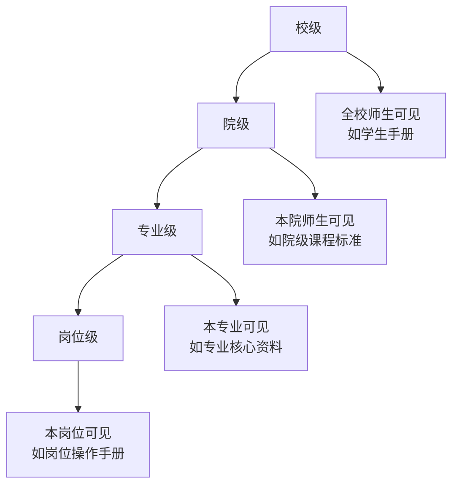
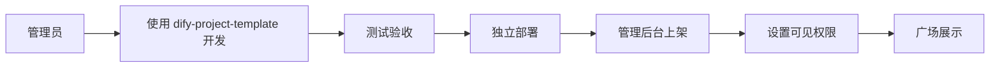
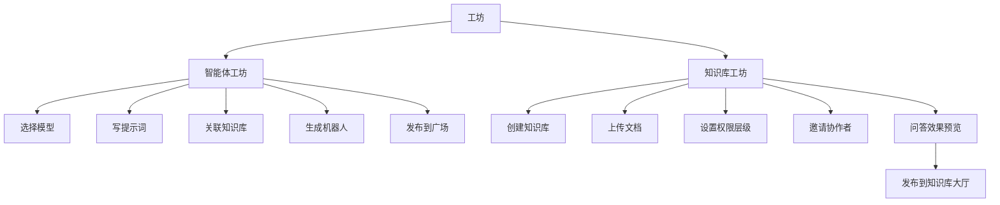
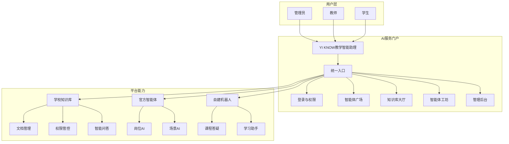
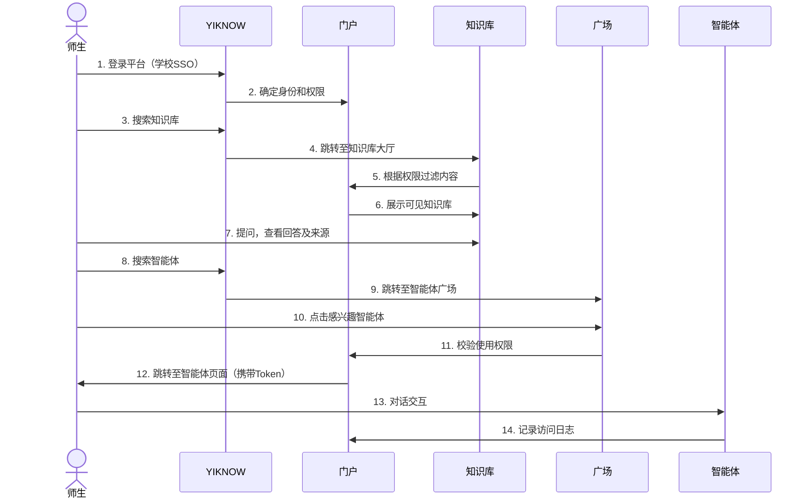
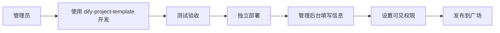
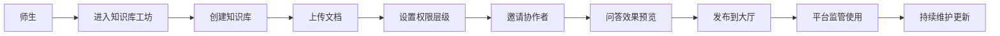
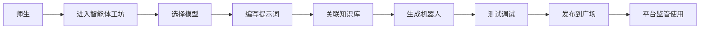

# 学校 AI 服务平台建设方案

## 一、项目背景

学校在教学管理过程中面临三个突出问题：一是课程资料、实训指导、岗位标准等教学资产散落在教师个人电脑中，无法复用和共享；二是师生比不足，学生课后疑问得不到及时解答；三是 AI 技术发展迅速，但师生缺乏简单易用的 AI 工具渠道。

为此，规划建设一套部署在学校内部的 AI 服务平台，面向全校师生提供知识库沉淀、官方智能体和自建机器人三类核心能力，让学校逐步积累专属数智资产，让师生零门槛使用 AI 辅助教学与学习。

---

## 二、平台核心能力

平台围绕四大模块展开建设：

| 模块 | 定位 | 核心功能 | 使用对象 |
|------|------|----------|----------|
| **学校知识库** | 沉淀专属数智资产 | 上传各类文档转化为可对话的知识资产；四级权限保护；校内共建、引用溯源、版本管理 | 全体师生 |
| **官方智能体** | 预置专用机器人 | 管理员搭建复杂智能体；独立部署后上架广场 | 全体师生 |
| **自建简易机器人** | 零代码创建 AI 助手 | 师生通过工坊选择模型、写提示词、关联知识库，快速生成自己的机器人 | 全体师生 |
| **YI KNOW 教学智能助理** | 职业教育场景化教学智能助理 | 统一导航入口，自然语言搜索全校知识库、智能体和外部教学平台 | 全体师生 |

### 2.1 学校知识库

**权限体系**：

**功能特性**：

| 特性 | 说明 |
|------|------|
| **校内共建** | 创建者可邀请特定老师或学生团队共同维护 |
| **透明展示** | 展示文档数量、查看目录、问答效果预览 |
| **全类型支持** | PDF、Word、PPT、Excel、视频、图片、网页等 |
| **引用溯源** | AI 回答时标注来源文档及具体位置 |
| **版本管理** | 文档更新迭代保留历史版本 |

### 2.2 官方智能体

由管理员使用 `dify-project-template` 工具开发，具备复杂前后端功能，上架到广场供师生使用。

**典型场景**：
- **岗位批量创建**：根据岗位描述或人才培养方案，智能拆解生成岗位能力模型
- **场景批量创建**：根据教学场景需求，批量生成教学设计方案

**上架流程**：

### 2.3 自建简易机器人

师生通过智能体工坊和知识库工坊，简易配置快速生成 AI 对话助手。

**平台监管**：所有自建机器人和知识库的使用情况由平台统一记录，管理员可查看使用统计。

### 2.4 YI KNOW 教学智能助理

YI KNOW 是平台的统一入口层，定位为职业教育场景化教学智能助理。师生登录后，YI KNOW 作为首页呈现，通过自然语言搜索或分类浏览，快速找到全校所有 AI 资源和教学工具。

**可导航的三类资源**：

| 资源类型 | 具体示例 |
|----------|----------|
| **学校知识库** | 金融专业知识库、物流专业知识库、数控实训知识库、酒店管理案例库等 |
| **智能体助手** | 岗位批量创建助手、场景批量创建助手、课程答疑机器人、师生自建机器人等 |
| **外部教学平台** | 产业联盟与品牌运营平台、职业岗位学习平台、实践场景学习平台、能力测评认证平台等 |

**使用方式**：
- **自然语言搜索**：输入"金融专业岗位标准"，直接定位到金融专业知识库和对应的岗位智能体
- **分类浏览**：按专业、场景、平台类型多维度筛选
- **最近使用/收藏**：个人常用资源和工具一键直达

**外部教学平台的 AI 引导功能示例**：

**职业岗位学习平台**：学生问"我想做网络安全工程师，需要学什么？"，YI KNOW 自动推荐网络安全工程师岗位页面，展示岗位能力模型、典型工作任务和涉及证书，并给出学习路径建议。

**实践场景学习平台**：教师问"信息安全专业有哪些实训场景？"，YI KNOW 展示该专业下已发布的实践场景列表，标注每个场景关联的岗位、能力点和任务数，教师可一键进入场景详情。

**能力测评认证平台**：学生问"我距离岗位认证还差哪些能力？"，YI KNOW 调取学生能力画像，对比岗位认证标准，直观展示已达成能力和待提升项，并推荐对应的测评任务和练习资源。

**产业联盟与品牌运营平台**：用户问"我们学校有哪些校企合作单位？"，YI KNOW 展示合作企业列表、合作类型和重点项目成果，支持快速查看企业详情和专家资源。

YI KNOW 本身不存储业务数据，而是通过索引全校知识库、智能体和外部平台的元数据，为师生提供统一的发现和导航能力。

---

## 三、系统框架

### 3.1 总体架构

### 3.2 前端层

| 模块 | 面向用户 | 功能 |
|------|----------|------|
| **YI KNOW 首页** | 全体师生 | 统一导航入口，搜索知识库、智能体和外部平台 |
| **平台管理后台** | 管理员 | 组织用户对接、权限管理、智能体上架、发布文章 |
| **智能体广场** | 全体师生 | 浏览和使用官方智能体、自建机器人 |
| **知识库大厅** | 全体师生 | 查看有权限的知识库，进行问答检索 |
| **智能体工坊** | 全体师生 | 创建自己的对话机器人 |
| **知识库工坊** | 全体师生 | 创建和维护知识库 |

### 3.3 服务层

| 系统 | 技术栈 | 职责 |
|------|--------|------|
| **平台业务服务** | Java + MySQL | 用户、权限、广场、文章、知识库管理、Token 签发、访问审计 |
| **学校知识库** | Java + Milvus | 自研独立模块，负责文档解析、向量存储、权限过滤、智能检索 |
| **Dify/MaxKB 引擎** | Python + PostgreSQL | 支撑师生自建智能体、知识库对话、模型调度 |
| **dify-project-template** | Flask + Dify | 官方智能体工作流开发与功能维护，独立部署后上架 |

### 3.4 数据层

| 数据库 | 技术选型 | 存储内容 |
|--------|----------|----------|
| **平台业务数据库** | MySQL | 用户、角色、智能体目录、文章、配置、访问日志 |
| **知识库数据库** | MySQL | 知识库元数据、文档目录、权限映射 |
| **知识库向量库** | Milvus | 文档分块向量数据 |
| **Dify/MaxKB 数据库** | PostgreSQL | 智能体配置、对话记录、知识库向量数据 |
| **官方智能体数据库** | PostgreSQL | 官方智能体配置、对话记录 |

---

## 四、核心业务流程

### 4.1 师生使用平台

### 4.2 管理员上架官方智能体

### 4.3 师生创建和维护知识库

### 4.4 师生创建机器人

